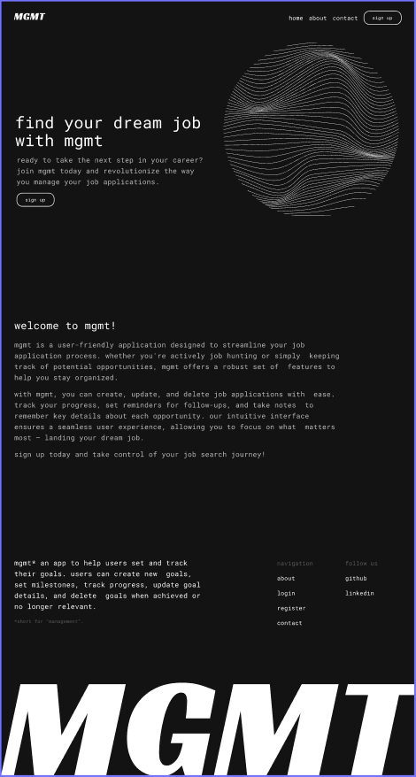

# MGMT Frontend

Welcome to the frontend repository of MGMT! This repository contains the code for the frontend application built with Next.js and Tailwind CSS.

## About MGMT

MGMT is an app designed to streamline your job application process. Whether you're actively job hunting or simply keeping track of potential opportunities, MGMT offers a robust set of features to help you stay organized.



## Technologies Used

- [Next.js](https://nextjs.org/)
- [Tailwind CSS](https://tailwindcss.com/)
- [Vercel](https://vercel.com/) (for hosting)
- [figma](https://figma.com/) (design/prototype)

## Getting Started

To get a local copy of the project up and running, follow these steps:

1. Clone this repository:

   ```bash
   git clone git@github.com:vincentpalomo/mgmt-frontend.git
   npm install
   npm run dev
   ```

2. Navigate to the project directory:

```bash
cd mgmt-frontend
```

3. Install dependencies:

```bash
npm install
```

4. Start the development server:

```bash
npm run dev
```

5. Open your browser and navigate to http://localhost:3000 to view the app.

## Contributing

Contributions are welcome! Please see the contribution guidelines for more information.

## Deployment

The frontend of MGMT is deployed on Vercel. Visit https://mgmt.vercel.app/ to view the live application.
License

This project is licensed under the MIT License.

Feel free to customize the content and formatting according to your project's specific details and requirements.
